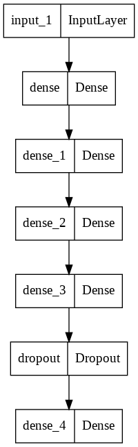
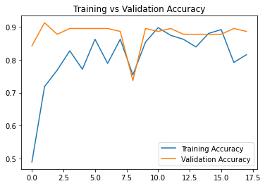
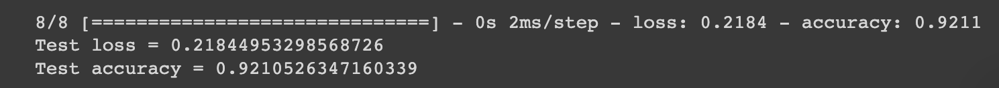

# Breast Cancer Classification
A basic feed-forward neural network to classify tumors as malignant or benign. 

## 1. Summary
The goal of this project was to create an accurate neural network model to classify tumors as malignant / benign, thus attempting to detect breast cancer correctly. I used the [University of Wisconsin Breast Cancer dataset](https://www.kaggle.com/datasets/uciml/breast-cancer-wisconsin-data) to train the model. 

## 2. IDE and Framework
This project was completely coded on Google Colab. The main frameworks used were Pandas, Scikit-learn, and Tensorflow Keras.

## 3. Methodology
### 3.1 Data Pipeline
The plan for data processing was to identify/remove unneeded variables and encode the target variable as a proper binary label. Then, the data was split 60:20:20 into train / validation / test sets. 

### 3.2 Model Pipeline
I constructed a pretty basic feed-forward network, using the basic rule of thumb to reduce nodes for each subsequent dense layer. A basic structure of the model is shown in the figure below.

The model was trained on a batch size of 16 and a tentative start of 30 epochs. Early stopping was applied and stopped the training at Epoch 18, with a training accuracy of 81.5% and a validation accuracy of 88.6%. Graphs of the progression of both loss and accuracy over training is shown below. 

 

## 4. Results
The accuracy of the model on the test set is shown below.

